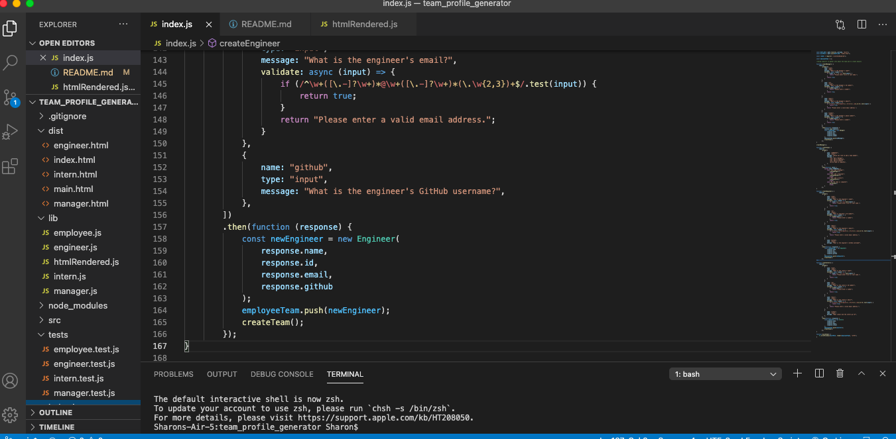

# team_profile_generator

## Installation/Deployment

Go to this link: <https://github.com/skimmers/team_profile_generator> and examine the files. Download the index.js file and open it in visiual studio code and type "node index.js" in the integrated terminal to run the application. 

## Goal

The goal is to use JavaScript, Node.js, Inquirer, and Jest to create an html file off of the user's answers to the questions in the terminal. My files must also pass their tests. 

These are the requirements I had to meet: 

* GIVEN a command-line application that accepts user input
* WHEN I am prompted for my team members and their information
* THEN an HTML file is generated that displays a nicely formatted team roster based on user input
* WHEN I click on an email address in the HTML
* THEN my default email program opens and populates the TO field of the email with the address
* WHEN I click on the GitHub username
* THEN that GitHub profile opens in a new tab
* WHEN I start the application
* THEN I am prompted to enter the team manager’s name, employee ID, email address, and office number
* WHEN I enter the team manager’s name, employee ID, email address, and office number
* THEN I am presented with a menu with the option to add an engineer or an intern or to finish building my team
* WHEN I select the engineer option
* THEN I am prompted to enter the engineer’s name, ID, email, and GitHub username, and I am taken back to the menu
* WHEN I select the intern option
* THEN I am prompted to enter the intern’s name, ID, email, and school, and I am taken back to the menu
* WHEN I decide to finish building my team
* THEN I exit the application, and the HTML is generated

## DEMO

# Purpose

I believe the purpose of this assignment was to help me get practice in installing inquirer, installing node_modules, insatlling jest, downloading package.json, coding with javascript, and testing. 

I learned how to download inquirer, creating package.json files, using the terminal for prompts, and testing. 

# Note

I was unable to successfully complete this assignment. For some reason, my prompts do not cycle through all the way and stop after the first function. As a result, I was unable to generate an HTML file off of the user's input. If there is any advice as to how to fix this please let me know! However, I was able to pass all the tests :) 